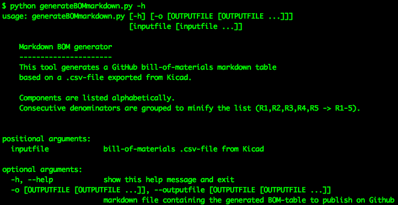

##  : `.csv` to `markdown` BOM generator tool

### What

This repository contains python code to generate a `markdown` formatted file which will contain the bill-of-materials for a [KiCad](http://kicad-pcb.org) project. The table inside this `markdown` document sources its content from the [KiCad](http://kicad-pcb.org) `.csv` export.

This generator has been developed, based on [KiCad version 5.1.2](http://kicad-pcb.org/blog/2019/04/KiCad-5.1.2-Release/).

### Why

The bill-of-materials is an implicit part of any electronics project. When publishing such a project on GitHub, it is important that interested people can view this information in an easily human-readable format.

### How

The code for this script has been written in [Python 2.7.15](https://www.python.org/downloads/release/python-2715/) on [MacOS High Sierra](https://en.wikipedia.org/wiki/MacOS_High_Sierra). It has been tested in parallel on [Windows 10](https://www.microsoft.com/en-us/windows) with [Python 3.7.3](https://www.python.org/downloads/release/python-373/). The script only uses `sys`, `OS` and `argparse` functionalities, which come with the standard distribution. As such, there are no references to any external libraries.

The current version has been written as a stand-alone tool. The input-file is passed as an argument. The output-file is generated in the same folder, or on a custom location (if defined by an optional argument).

KiCad also provides an [API](http://docs.kicad-pcb.org/doxygen/classBOM__PLUGIN.html), and the possibility to integrate custom [BOM-export plugins](http://docs.kicad-pcb.org/5.1.2/en/eeschema/eeschema.html#command-line-format-example-for-python-scripts) directly in the application. This is the wish-list item for the next version of this tool.

### Progress status

 - [x] have an [idea](#what), and a [reason](#why) why to make it
 - [x] decide on how it should [work](#how)
 - [x] write the [code](source/)  
 - [x] [test](#how) it properly
 - [ ] document the [source code](source/) and the important [snippets](#snippets)
 - [ ] write a [user manual](#how_to_use_it)
 - [ ] add [sample material](examples/) (Kicad `.csv` test-data, and processed minified markdown documents)

### How to use it

.........coming soon........

### Contributors

If you are having any good suggestions, just drop me a line [:email:](http://nostradomus.ddns.net/contactform.html).
If feasible, I'll be happy to implement any proposed improvements.
And if you are having lots of time, I'll be happy to share the work with you ;-).

When you create your own version, don't forget to tell us about your work. We'll be happy to publish a link in the :confetti_ball:Hall of Fame:confetti_ball:.

### :globe_with_meridians: License

At this moment, there is no specific license attached to this project.

So, on today's date, if you like this content, have fun with it (at your own risk of course :-D), and especially, be creative.

Oh, and when using anything from this repository, it is highly appreciated if you mention its origin.

If you would like to use any of this work (or the whole project) for commercial use, first [contact us :email:](http://nostradomus.ddns.net/contactform.html), so we can add the appropriate license, which best fits your business.
